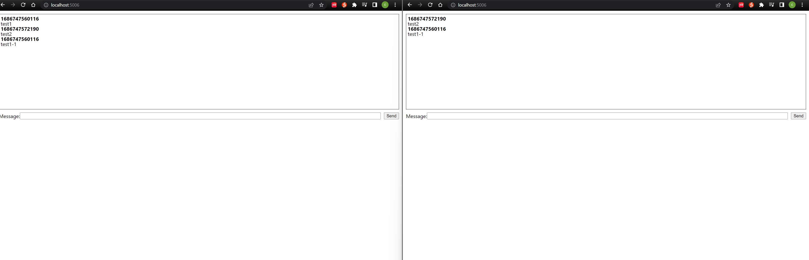

# .NET 7 SignalR

# TechStack

- [x] SignalR
- [x] Hangfire



```javascript
# server
$ dotnet new web -o net7-signalr-demo

$ code -r net7-signalr-demo

$ dotnet add package Microsoft.TypeScript.MSBuild

# client
$ npm i -D -E clean-webpack-plugin css-loader html-webpack-plugin mini-css-extract-plugin ts-loader typescript webpack webpack-cli

$ npm i @microsoft/signalr @types/node

$ npm run release

$ dotnet run

# hangfire
$ dotnet add package Hangfire

$ dotnet add package Hangfire.MemoryStorage

```
